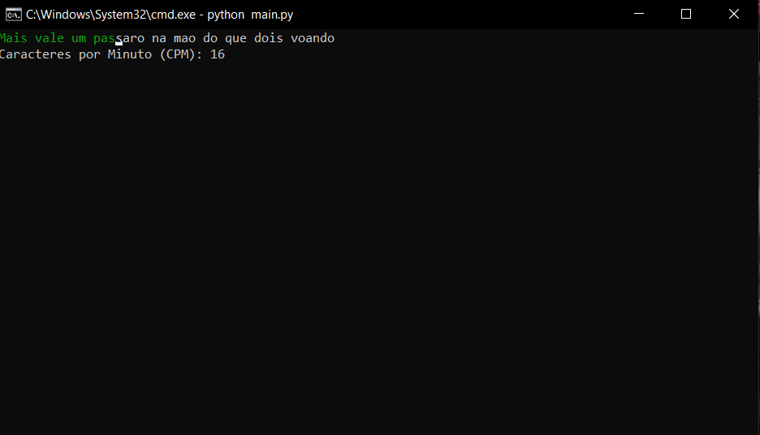
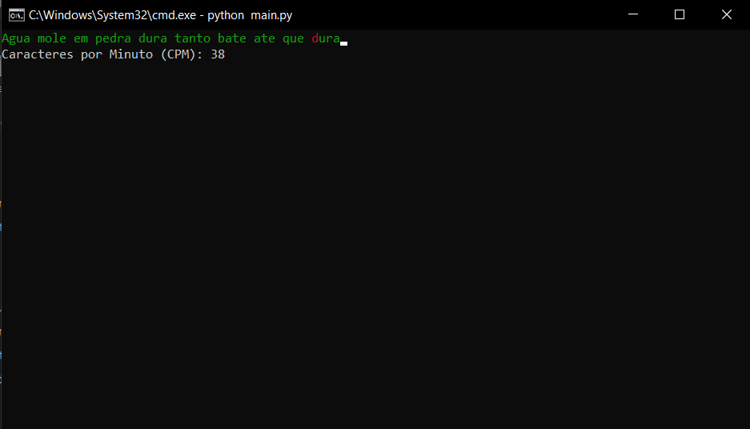
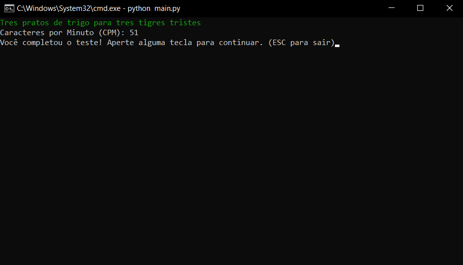

# Radar-de-Digitos

Software que calcula a velocidade de digitação do usuário por meio de frases sorteadas aleatoriamente.
O programa todo opera no terminal do computador, e suas funcionalidades foram feitas com o módulo *Curses*. 

